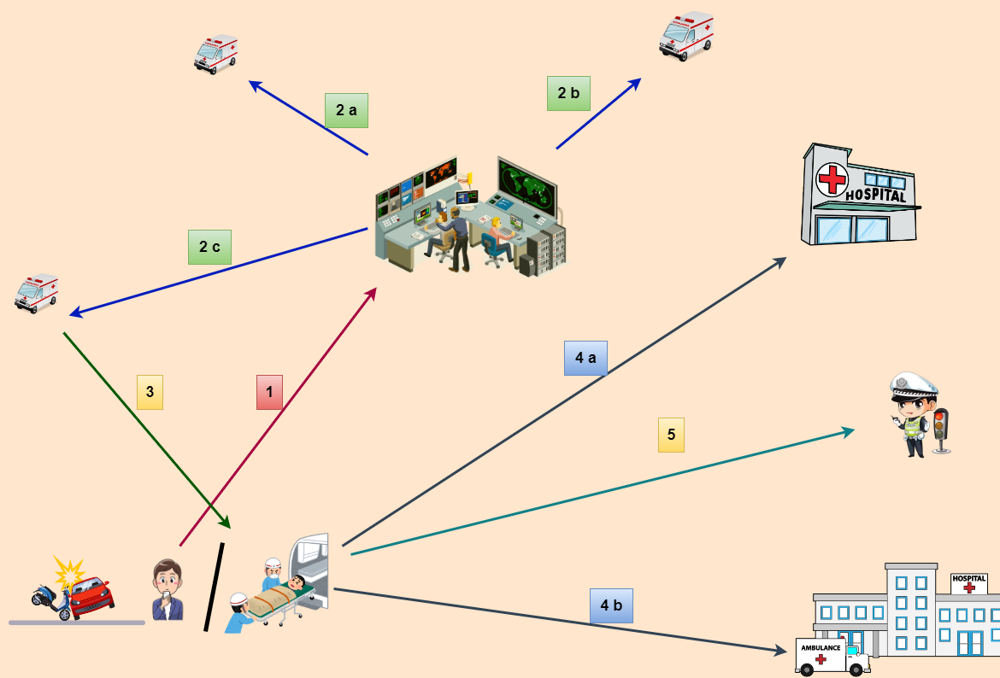
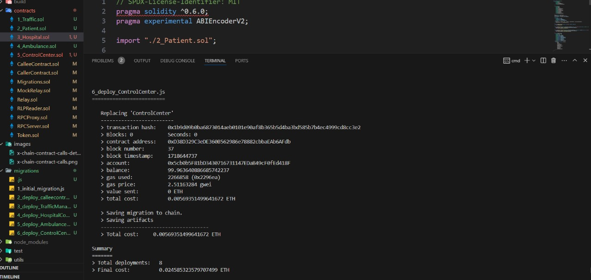

# Blockchain-Based Emergency Healthcare System

## Introduction
The rapid advancements in blockchain technology have opened up new possibilities in various sectors, including healthcare. This project leverages the unique properties of blockchain to create an efficient, transparent, and decentralized emergency response system. The traditional emergency response systems often face challenges such as delays in communication, lack of transparency, and inefficiencies in coordination among different entities like hospitals, ambulances, and traffic authorities. 

In this project, we propose a solution where smart contracts are deployed on various blockchain networks to manage and streamline the entire emergency response process. These smart contracts ensure secure, immutable, and transparent interactions between the involved parties. The main components of this system include hospital smart contracts, ambulance smart contracts, patient smart contracts, control center smart contracts, and traffic police smart contracts. Each smart contract plays a crucial role in ensuring timely and coordinated responses to medical emergencies.

## Problem Statement
Emergency response systems are critical for saving lives during medical emergencies. However, the current systems face several challenges:

1. **Inefficiencies in Coordination**: The coordination between different entities such as hospitals, ambulances, and traffic authorities is often inefficient, leading to delays in providing medical assistance.
2. **Lack of Transparency**: The traditional systems lack transparency, making it difficult to track the actions and decisions taken during an emergency.
3. **Communication Delays**: Delays in communication between the observer of the accident, control centers, ambulances, and hospitals can result in significant time loss, which could be critical in emergency situations.
4. **Data Management**: Managing and accessing patient medical records during emergencies can be cumbersome and time-consuming with traditional methods.

By implementing a blockchain-based solution, we aim to address these challenges. Smart contracts provide a decentralized and transparent way to manage the interactions and data exchanges between different entities involved in emergency response. This ensures that all actions are securely recorded on the blockchain, accessible to authorized parties, and executed efficiently without intermediaries.

## Model
The system comprises multiple smart contracts, each deployed on different blockchains supporting smart contracts such as Ethereum. Below is an image illustrating the overall model of our blockchain-based emergency healthcare system.

### Components
1. **Hospital Smart Contract**
    - Registers patients and doctors.
    - Coordinates with the control center to access patient medical records.
    - Interacts with the patient smart contract for medical history.
    - Each hospital has its own smart contract deployed on a different network.
    - Hardcoded information about the hospital, such as name, location, and facilities.
2. **Ambulance Smart Contract**
    - Receives accident details from the control center.
    - Provides current location and status (busy/free).
    - Responds to control center commands.
    - Accesses hospital information and traffic data.
3. **Control Center Smart Contract**
    - Receives accident information from observers.
    - Verifies the information with traffic police video feedback.
    - Contacts the nearest ambulances and directs one to the accident location.
    - Maintains a database of ambulances.
4. **Patient Smart Contract**
    - Holds all medical records of the patient.
    - Shares details with other smart contracts like ambulance and hospital.
    - Protected by a passkey for accessing sensitive information.
5. **Traffic Police Smart Contract**
    - Monitors traffic and guides the ambulance to the nearest hospital.
    - Verifies accidents through live video feed.
    - Optimizes routes to reduce travel time for ambulances.

## Set Up
To deploy these smart contracts on a local blockchain, you need the following tools installed:

- [Node](https://nodejs.org/en/)
- [Truffle](https://www.trufflesuite.com/truffle)
- [Ganache](https://www.trufflesuite.com/ganache)

Then execute the following steps:

1. Clone the repository: `git clone git@github.com:Rahul1227/CrossChain-Communication-between-ethereum-to-ethereum.git`
2. Change into the project directory: `cd CrossChain-Communication-between-ethereum-to-ethereum/`
3. Install all dependencies: `npm install`
4. Start Ganache (make sure it listens to port 7545)
5. Deploy contracts: `truffle migrate --reset`
6. Run the tests with `truffle test`

## Working Illustration
Below is an illustration of how the system works in case of an emergency.

### Workflow
1. The observer of the accident contacts the control center to inform about the accident and provides necessary information.
2. The control center verifies the information with the help of traffic police video feedback.
3. The control center contacts the nearest ambulances in its database.
4. The nearest available ambulance responds and heads to the accident location.
5. The ambulance collects the patient and selects the best and nearest hospital.
6. The ambulance, guided by traffic police, takes the patient to the hospital.

## Credits
This project is a derivative of the original repository [Asynchronous Cross-Blockchain Smart Contract Calls](https://github.com/pantos-io/x-chain-smartcontracts), which represents ongoing work conducted within the [TAST](https://dsg.tuwien.ac.at/projects/tast/) research project.
